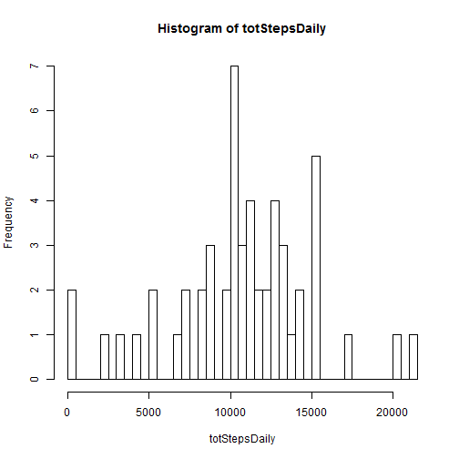

### Loading and preprocessing the data
  
  
#### 1. Load the data

```r
aData <- read.csv(file=".\\data\\activity.csv",header=TRUE, stringsAsFactors =FALSE)
head(aData)
```

```
##   steps      date interval
## 1    NA 10/1/2012        0
## 2    NA 10/1/2012        5
## 3    NA 10/1/2012       10
## 4    NA 10/1/2012       15
## 5    NA 10/1/2012       20
## 6    NA 10/1/2012       25
```

#### 2. Preprocess the data 
##### a. Create a factor variable which has weekend or weekday value

The date variable is converted into a POSIXlt value and the isWeekend function is used to identify if the date is a weekday or weekend. This value is stored in variable daytype as a factor.


```r
library(timeDate)

aData$daytype <- ifelse (isWeekend(strptime(aData$date, "%m/%d/%Y" )), "weekend", "weekday")
aData <- transform(aData, daytype = factor(daytype))
```


##### b. Create a dataset with the NA removed

The dataset which has has all rows with NA values for the variable steps is called **aData.rmNA**.


```r
aData.rmNA <- aData[which(!is.na(aData$steps)), ]
```

  
  
### What is mean total number of steps taken per day?

#### 1. Calculate total number of steps taken per day

```r
totStepsDaily <- tapply(aData.rmNA$steps, as.factor(aData.rmNA$date), sum)
```

#### 2. Create a histogram of the total number of steps taken daily

```r
hist(totStepsDaily, breaks=60)
```

 

#### 3. Calculate and report the mean and median of the total number of steps taken per day

```r
summary(totStepsDaily)
```

```
##    Min. 1st Qu.  Median    Mean 3rd Qu.    Max. 
##      41    8841   10760   10770   13290   21190
```

```r
meanSteps <- mean(totStepsDaily)
```

### What is the average daily activity pattern?
The mean number of daily steps is 1.0766189 &times; 10<sup>4</sup>. The median is close to the mean.This is investigated further by plotting the steps as a function of the 5 minute intervals starting at midnight.  


#### 1. Make a time series plot (i.e. type = "l") of the 5-minute interval (x-axis) and the average number of steps taken, averaged across all days (y-axis)

- This is done by first calculating the mean values for each interval across all dates using tapply and storing it in an array called y. Note that the interval variable has been cast as a factor.
- The names of the y array are the interval values. These names are used to create the x axis values using strptime.
- The x axis values has been converted into a POSIXlt class and stored in variable interval_time. The plot function intelligently formats the x asis for POXIXlt objects.  


```r
y <- tapply(aData.rmNA$steps, as.factor(aData.rmNA$interval), mean)
interval_time <- strptime(sprintf("%04d", as.numeric(names(y))), format="%H%M")
plot(interval_time, y, type="l", xlab = "", ylab = "Mean steps for each 5 minute interval")
```

 

#### 2.Which 5-minute interval, on average across all the days in the dataset, contains the maximum number of steps?

This is done by sorting the mean values in decreasing order for each interval calculated in the previous step and using the order to find out the first time interval stored in interval_time.


```r
aData.rmNA$interval[order(y, decreasing=TRUE)[1]]
```

```
## [1] 835
```

```r
interval_time[order(y, decreasing=TRUE)[1]]
```

```
## [1] "2015-07-17 08:35:00 PDT"
```
This is the interval with the value 835. The time is the 5 minute interval starting at 8:35 am. This is reasonable as it is the general time when most people go to work.


### Imputing missing values

#### 1.Calculate and report the total number of missing values in the dataset (i.e. the total number of rows with NAs)

```r
length(which(is.na(aData$steps)))
```

```
## [1] 2304
```

#### 2.Devise a strategy for filling in all of the missing values in the dataset. The strategy does not need to be sophisticated. For example, you could use the mean/median for that day, or the mean for that 5-minute interval, etc.


The mean for each Interval based on non-missing data is used to impute the missing values. The mean values are stored in an array variable named meanStepsInterval. This array can be indexed by the interval values represented as character strings.


```r
meanStepsInterval <- tapply(aData.rmNA$steps, as.factor(aData.rmNA$interval), mean)
```


#### 3.Create a new dataset that is equal to the original dataset but with the missing data filled in.

The dataset which has has all rows with NA values for the variable steps filled in with imputed value is called **aData.noNA**.

```r
aData.noNA <- aData

## Replace the missing step values with the mean for that interval
for (i in 1:dim(aData.noNA)[1]){
  if (is.na(aData.noNA$steps[i])) {
    aData.noNA$steps[i] <- meanStepsInterval[as.character(aData.noNA$interval[i])]
  }
}
```

#### 4.Make a histogram of the total number of steps taken each day and Calculate and report the mean and median total number of steps taken per day. Do these values differ from the estimates from the first part of the assignment? 


```r
totStepsDaily.noNA <- tapply(aData.noNA$steps, as.factor(aData.noNA$date), sum)
hist(totStepsDaily.noNA, breaks=60)
```

 

```r
summary(totStepsDaily.noNA)
```

```
##    Min. 1st Qu.  Median    Mean 3rd Qu.    Max. 
##      41    9819   10770   10770   12810   21190
```

##### What is the impact of imputing missing data on the estimates
By using the interval means to populate the missing values the mean number of steps per interval should not change but the median may change. This is confirmed by the summary above.


### Are there differences in activity patterns between weekdays and weekends?
#### Plot the weekday and weekend data
#### Summarize the data into intervals and create a panel plot

In the first step a dataframe is created with two columns called weekday and weekend based on the daytype variable, and the values being the mean for the interval. The rownames are the interval values.


```r
## Note the intervals vecome the rownames of the vector returned by tapply
pData <- as.data.frame(tapply(aData.noNA$steps, list(as.factor(aData.noNA$interval),aData.noNA$daytype) , mean))
pData$interval_time <- strptime(sprintf("%04d", as.numeric(rownames(pData))), format="%H%M")


## Reshape the data tbe long instead of wide for use by qplot. facets needs to be a factor.
l <- reshape(pData, varying = c("weekday", "weekend"), v.names = "steps", timevar = "daytype", times = c("Weekday", "Weekend"),direction = "long")
l <- transform(l, daytype = factor(daytype))

## Plot using ggplot
library(ggplot2)
qplot(interval_time, steps, data = l, facets = daytype ~ ., geom=c("line"))
```

 

As expected the interval step patterns are different when broken out by weekdays and weekends. The weekdays have a pronounced spike in the morning hours between 8:30 am and 10 am and another spike at about 6:30 pm,  whereas the weekend steps activity is more evenly distributed during the course of the day.


